## Completando padrões

O cérebro tenta completar as formas que vemos para encontrar padrões, por exemplo, na primeira imagem o cérebro costuma "perceber" um triângulo a mais no meio, mesmo que ele não tenha todo o seu perímetro devido à suas bordas que tem buracos

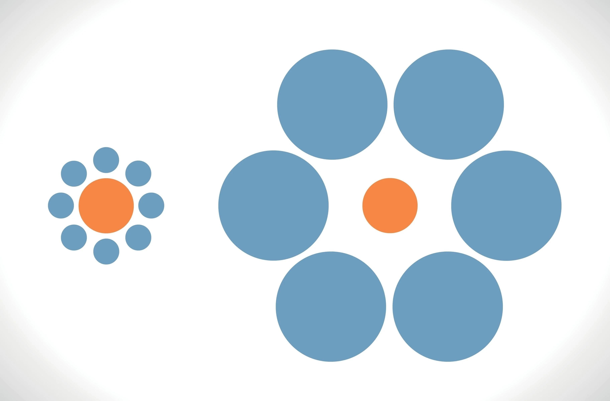

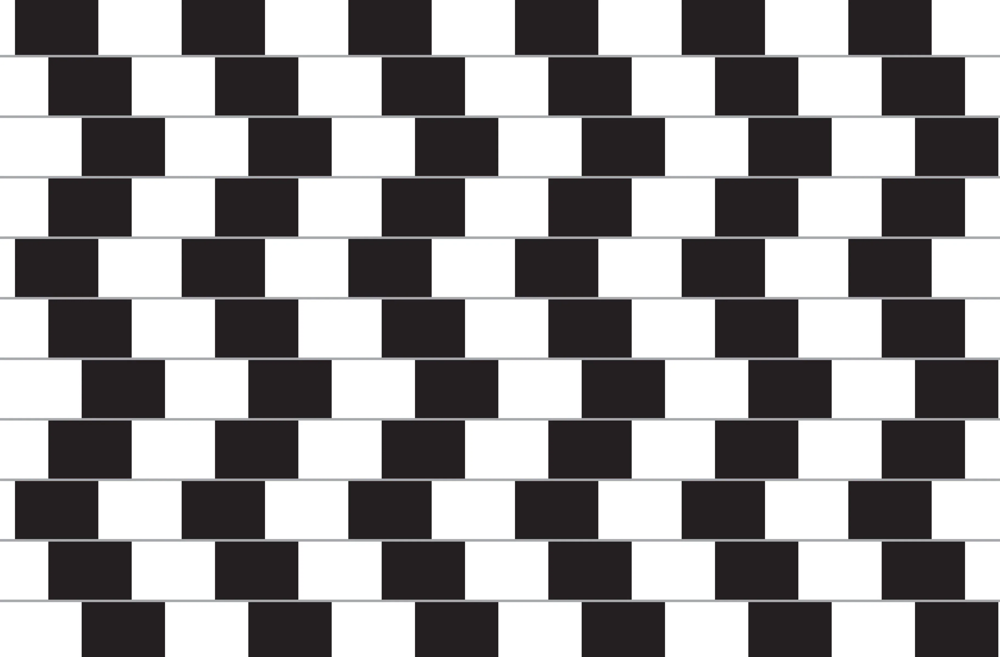

## Composição de cores

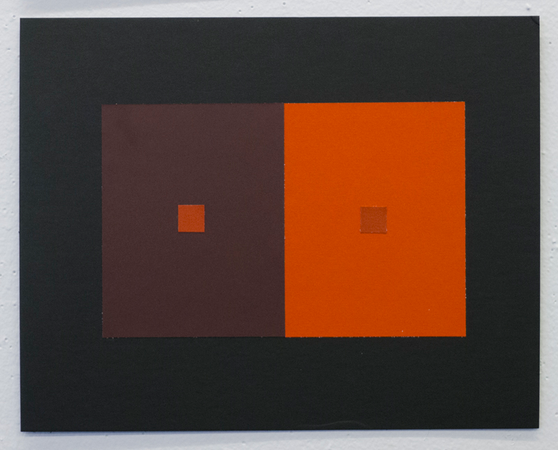

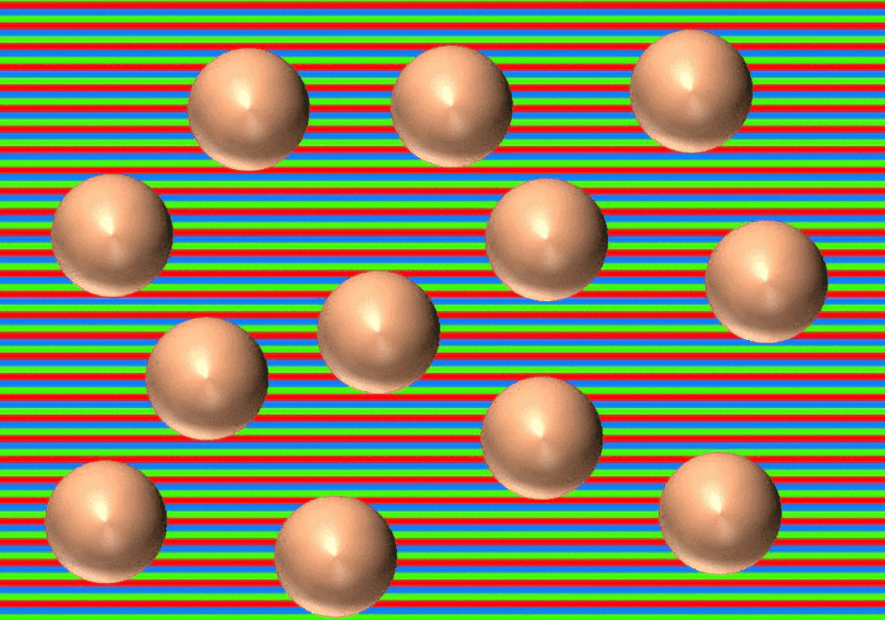

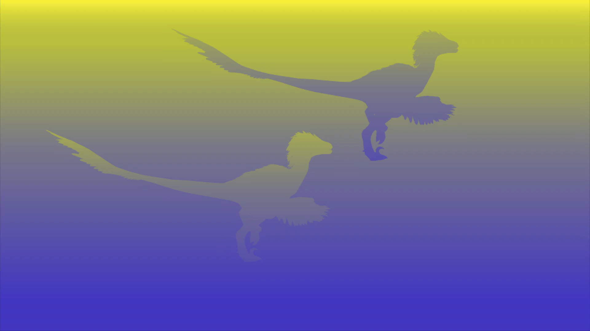

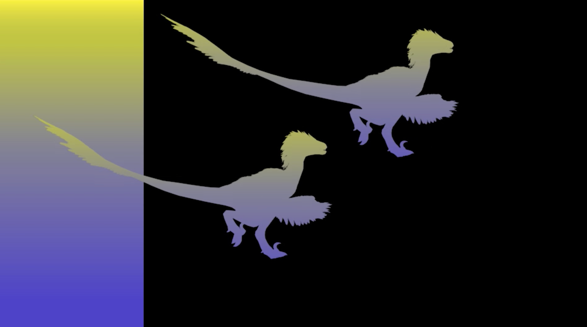

## Contraste de brilho

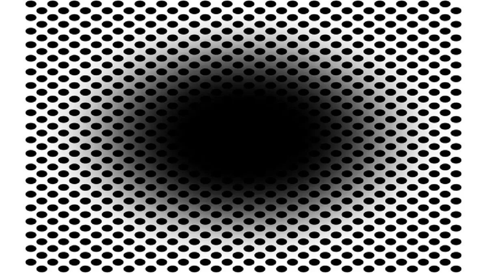

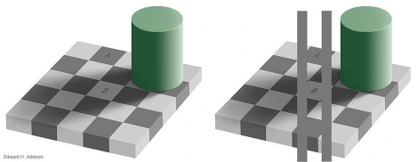

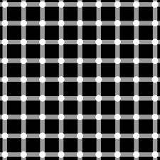

## Persistência e fixação de um pigmento

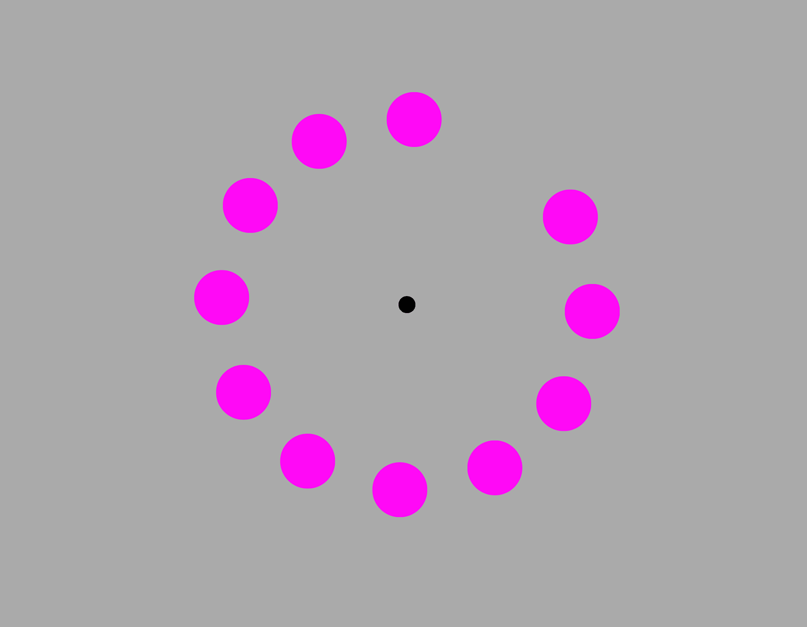

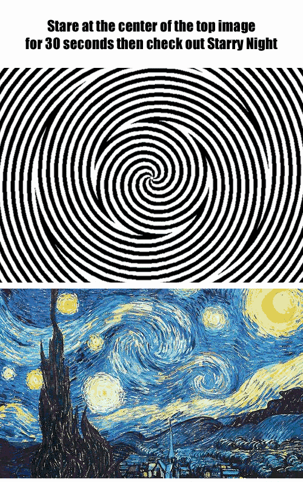

## Quarto de Ames

## Ilusões de ótica feitas por IA

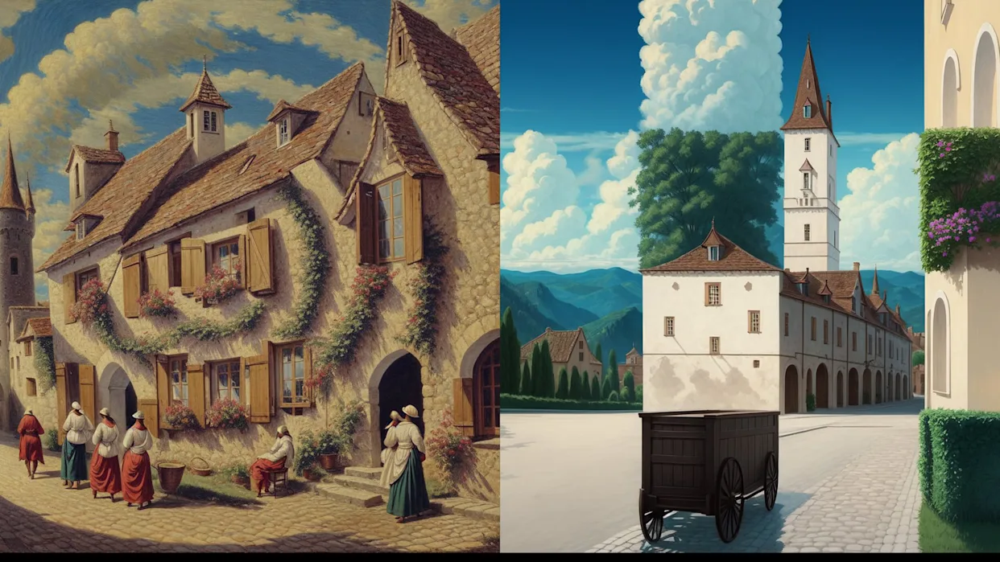

## Ilusão de perspectiva 3D em imagens 2D

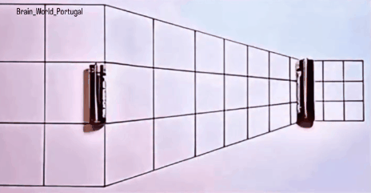

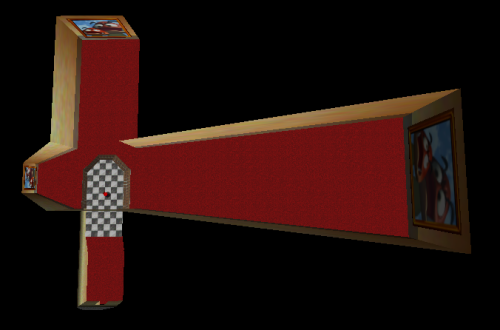

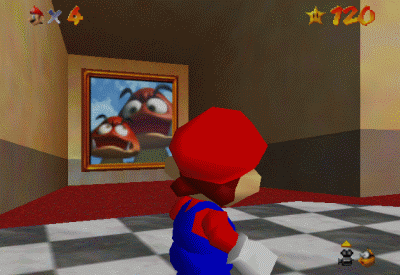

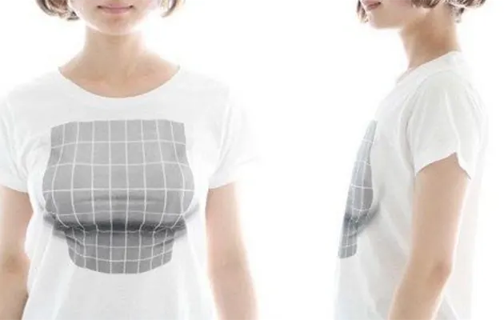

